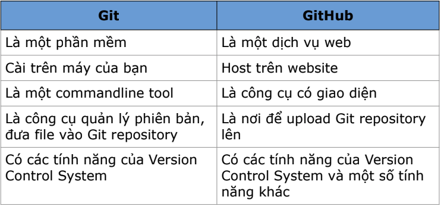

# Key Takeaways – Lesson 05: Playwright Tests & Selectors

## 1. Git Workflow Basics

### Clone
- `git clone <url>`: lấy toàn bộ repo từ remote về local
- Có thể đặt tên thư mục khi clone: `git clone <url> <new-folder>`

### Push
- Đẩy code từ local repository lên remote: `git push origin main`

### Pull
- Lấy cập nhật mới từ remote về local: `git pull origin <branch>`

### Merge Request (MR) / Pull Request (PR)
- MR/PR: gộp code từ nhánh này sang nhánh khác
- Reviewer: người xem lại code, giúp cải thiện chất lượng

### Convention
- Cách đặt tên branch:
  - `feat/lesson-5-login`
  - `fix/form-validation`
- Cách viết commit:
  - `feat: add login form`
  - `fix: missing input validation`

## 2. Playwright Test Structure

### Test Suite (`describe`)

test.describe('Feature name', () => {
  test('test case 1', async ({ page }) => { });
  test('test case 2', async ({ page }) => { });
});
### Hooks
- beforeAll, afterAll: chạy trước/sau tất cả test trong suite
- beforeEach, afterEach: chạy trước/sau mỗi test.
## 3. CSS Selector
- Cú pháp đơn giản ngắn gọn hơn.
- Không sử dụng các case phức tạp: contains text.

